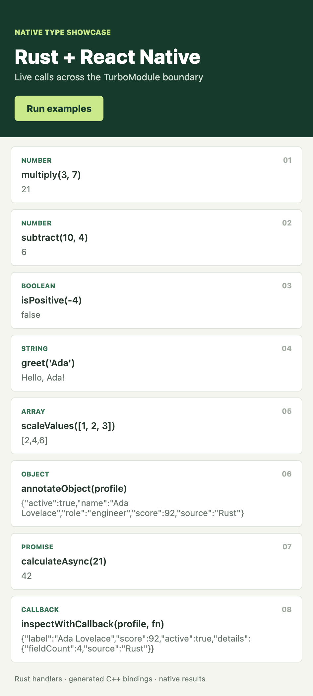

# @rejaul/react-native-rust

Generate Rust functions and native bindings from a React Native TurboModule TypeScript `Spec`. Write the API in TypeScript, implement its logic in Rust, and use the generated C ABI and C++ TurboModule bridge to call it from React Native.

The CLI currently targets the **C++ TurboModule** template created by [`create-react-native-library`](https://www.npmjs.com/package/create-react-native-library).

## Screenshots

The generated [`react-native-awesome-library-example`](react-native-awesome-library-example) app calling every generated method and rendering its live Rust result, on all three platforms:

| Android | iOS | Web |
| --- | --- | --- |
|  |  |  |

## Contents

- [Screenshots](#screenshots)
- [Requirements](#requirements)
- [Create a library](#create-a-library)
- [Add Rust functions](#add-rust-functions)
- [Use Rust in an app](#use-rust-in-an-app)
- [Build and run](#build-and-run)
- [Supported types](#supported-types)
- [Publish](#publish)
- [Troubleshooting](#troubleshooting)
- [Contributing](#contributing)
- [Code of conduct](#code-of-conduct)
- [Contact](#contact)
- [License](#license)

## Requirements

- Node.js 18 or newer for the CLI. Use a Node.js version supported by `create-react-native-library` when scaffolding a project.
- Rust stable (`rustup`, `cargo`).
- Android builds: Android SDK/NDK and `cargo-ndk`.
- iOS builds: macOS, Xcode command-line tools, and the Rust Apple targets.
- Web builds (`react-native-web`): [`wasm-pack`](https://rustwasm.github.io/wasm-pack/) and the `wasm32-unknown-unknown` Rust target (`rustup target add wasm32-unknown-unknown`).

## Create a library

Run from the parent folder where you want the library created:

```sh
npx --yes @rejaul/react-native-rust create react-native-awesome-library
```

The command runs `create-react-native-library`. In its prompts, select a **TurboModule using C++**. The CLI then initializes Rust from the generated TypeScript `Spec` and configures the C ABI, C++ methods, TypeScript wrappers, iOS CocoaPods linkage, Android CMake linkage, npm scripts, and Rust output ignore rules.

Install the generated project's dependencies:

```sh
cd react-native-awesome-library
yarn install
```

To run the CLI from its source checkout before publishing, build it once (`npm run build` from the checkout root), then invoke the compiled output by path from the desired parent folder:

```sh
node /path/to/rust_to_cpp/dist/react-native-rust.js create react-native-awesome-library
```

To add Rust support to an existing C++ TurboModule library, install the CLI and initialize it from that library's root:

```sh
npm install --save-dev @rejaul/react-native-rust
npx react-native-rust init
```

`init` refuses unsupported templates and existing `rust/` directories rather than overwriting them.

## Add Rust functions

The TypeScript `Spec` is the API source of truth. For example, declare a method in `src/NativeAwesomeLibrary.ts`:

```ts
export interface Spec extends TurboModule {
  multiply(a: number, b: number): number;
}
```

Generate Rust and native glue from the library root:

```sh
yarn rust:generate
```

The CLI creates a handler in `rust/src/api/multiply.rs`. Add the implementation there:

```rust
pub fn multiply(a: f64, b: f64) -> f64 {
    a * b
}
```

The generated Rust ABI wrapper, C++ TurboModule method, and TypeScript wrapper connect this function to React Native. Do not hand-edit generated C++ or wrapper code. After changing the `Spec`, run `yarn rust:generate` again. Existing Rust function bodies are preserved, and signature mismatches are reported.

Run Rust tests with:

```sh
yarn rust:test
```

## Use Rust in an app

For app-specific Rust code, run the CLI from the root of an existing React Native Community CLI app that has both `android/` and `ios/` folders:

```sh
npx react-native-rust init --app
npm install
```

The command creates a private local TurboModule package in `native/rust-module/`, adds it to the app as a local dependency, and generates its C++ bridge and Rust crate. It does not publish a separate library. App-local mode currently supports C++ TurboModule apps with both Android and iOS projects.

Edit `native/rust-module/src/NativeRustApp.ts` to declare methods, then implement their generated handlers under `native/rust-module/rust/src/api/`. From the app root, regenerate the bindings and React Native Codegen output with:

```sh
npm run rust:generate
```

Build the Rust archive for the target platform, then build and launch the React Native app:

```sh
npm run rust:build:android
npx react-native run-android
```

For iOS, build the XCFramework, install Pods, then launch the app:

```sh
npm run rust:build:ios
cd ios && pod install && cd ..
npx react-native run-ios
```

The generated module is app-local and can be used from the app's JavaScript imports. The root `example/` project in this repository exercises this workflow.

## Build and run

Run these commands from the library root. Generate TurboModule Codegen output with `yarn prepare` before building the host app.

### Android

Install the Rust Android targets and `cargo-ndk` once:

```sh
rustup target add aarch64-linux-android armv7-linux-androideabi i686-linux-android x86_64-linux-android
cargo install cargo-ndk
```

Build the Rust archives and generate native Codegen output:

```sh
yarn rust:build:android
yarn prepare
```

With an emulator running, start Metro in one terminal and launch Android from another:

```sh
cd example && yarn start --reset-cache
```

```sh
cd example && yarn android
```

The example command builds only for the connected device's ABI. Rust archives are generated for `arm64-v8a`, `armeabi-v7a`, `x86`, and `x86_64`.

### iOS

Build the Rust XCFramework and generate native Codegen output:

```sh
yarn rust:build:ios
yarn prepare
```

Install pods for the example app:

```sh
cd example/ios && pod install
```

Start Metro in one terminal and launch an iOS simulator from another:

```sh
cd example && yarn start --reset-cache
```

```sh
cd example && yarn ios --simulator "iPhone 17 Pro"
```

Rust outputs are written under `rust/build/` and included in the generated library's npm package configuration. Build each platform on a machine with its native toolchain.

The example screen in `example/src/App.tsx` exercises the supported scalar, JSON, Promise, and callback signatures.

### Web

Install `wasm-pack` and the `wasm32-unknown-unknown` target once:

```sh
cargo install wasm-pack
rustup target add wasm32-unknown-unknown
```

Build the WebAssembly package:

```sh
yarn rust:build:web
```

This compiles `rust/` to `rust/build/web/pkg/` with `wasm-pack build --target web`, reusing the same `rust/src/api/<method>.rs` handlers as native — no separate implementation is needed. It replaces the generated `src/rust-generated.tsx` module (used by web bundlers that don't understand Metro's `.native.` file convention, such as Vite or webpack) with a real, WASM-backed implementation instead of the "not supported on native platforms" stub used before this module exists. Call and await its exported `initRustWeb()` once before using any generated function on web, since loading a `.wasm` file is asynchronous:

```ts
import { initRustWeb, multiply } from 'react-native-awesome-library';

await initRustWeb();
multiply(3, 7); // 21
```

## Supported types

The generator supports these TypeScript-to-Rust/C++ mappings:

| TypeScript | Rust | C++ |
| --- | --- | --- |
| `number` | `f64` | `double` |
| `boolean` | `bool` | `bool` |
| `string` | `String` | `jsi::String` |
| `T[]`, `Array<T>`, `ReadonlyArray<T>` | `serde_json::Value` | `jsi::Array` |
| `CodegenTypes.UnsafeObject` | `serde_json::Value` | `jsi::Object` |
| `void` return | `()` | `void` |
| `Promise<T>` return | `Result<T, String>` | `jsi::Value` |
| `(args) => void` parameter | `&mut dyn FnMut(args)` | `jsi::Function` |

Arrays and `UnsafeObject` values cross the native boundary as JSON, so their contents must be JSON-safe. Promise results may use supported payload types, but nested Promises are not supported. Callbacks are invoked synchronously during the Rust handler call and may have up to four explicitly typed parameters; they must not be retained or called later. Promise methods cannot accept callbacks.

Typed object structs, optional or rest parameters, destructured parameters, generic methods, and overloads are not supported. Unsupported signatures fail before generated files are changed.

The same mappings apply on `react-native-web`: values cross as JSON strings via `wasm-bindgen` instead of the JSI C++ bridge, and callback parameters are passed as a JS function. See [Web](#web) for the build step and the async `initRustWeb()` call it requires.

## Publish

Before publishing a generated React Native library, generate its TypeScript/native outputs and build the Rust artifacts for the platforms you intend to ship:

```sh
yarn prepare
yarn rust:build:ios
yarn rust:build:android
yarn rust:build:web
npm pack --dry-run
```

To validate and publish this CLI package:

```sh
npm test
npm pack --dry-run
npm publish --access public
```

Pushing a version tag such as `v1.0.2` runs [`.github/workflows/publish.yml`](.github/workflows/publish.yml), which tests and publishes the matching package version. Configure npm trusted publishing for this repository and workflow before using the action; it publishes with provenance and does not require an `NPM_TOKEN` secret.

## Troubleshooting

- `cargo: command not found`: install Rust with `rustup`, then open a new terminal or run `source "$HOME/.cargo/env"`.
- Android CMake cannot find `android/generated/jni`: run `yarn prepare` from the library root.
- Android CMake cannot find a Rust `.a` archive: run `yarn rust:build:android` before launching the example.
- iOS reports a missing Rust XCFramework: run `yarn rust:build:ios`, then `pod install` in `example/ios`.
- `wasm-pack: command not found`: install it with `cargo install wasm-pack`, or run `react-native-rust doctor web` to check both prerequisites.
- The web app throws "Call and await initRustWeb()...": await `initRustWeb()` once before calling any other generated function; loading the `.wasm` file is asynchronous even though the generated calls are not.
- A React Native type is reported as unsupported: check the mappings and signature restrictions in [Supported types](#supported-types).

## Contributing

See [CONTRIBUTING.md](CONTRIBUTING.md) for development setup, testing, and contribution guidelines. Bug reports, feature requests, and pull requests are welcome. For code changes, run the CLI test suite and package check before submitting:

```sh
npm test
npm pack --dry-run
```

When changing type mappings or generated output, include tests for supported signatures, regeneration behavior, and unsupported signatures.

## Code of conduct

Participation in this project follows the [Code of Conduct](CODE_OF_CONDUCT.md). Please report conduct concerns through the repository's contact options.

## Contact

- Issues and feature requests: [GitHub Issues](https://github.com/DeveloperRejaul/react-native-rust/issues)
- Repository and maintainer: [DeveloperRejaul/react-native-rust](https://github.com/DeveloperRejaul/react-native-rust)

## License

This project is distributed under the [ISC License](LICENSE).
