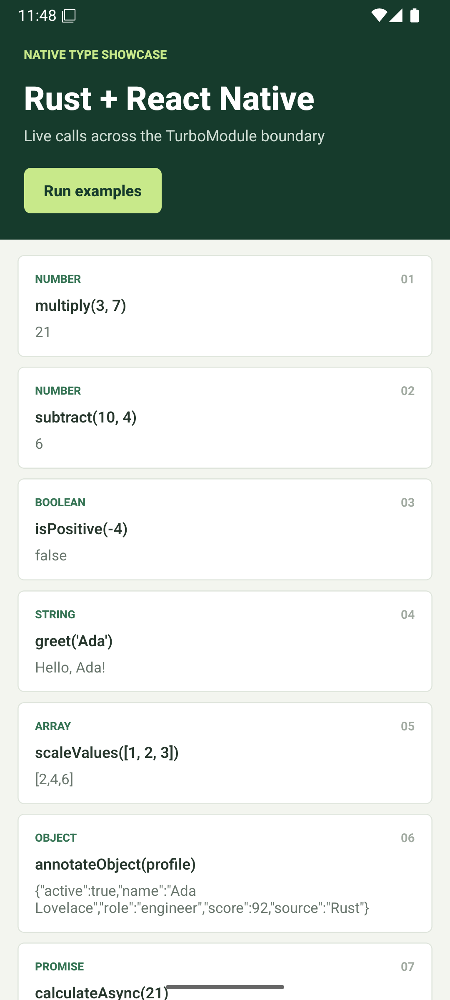
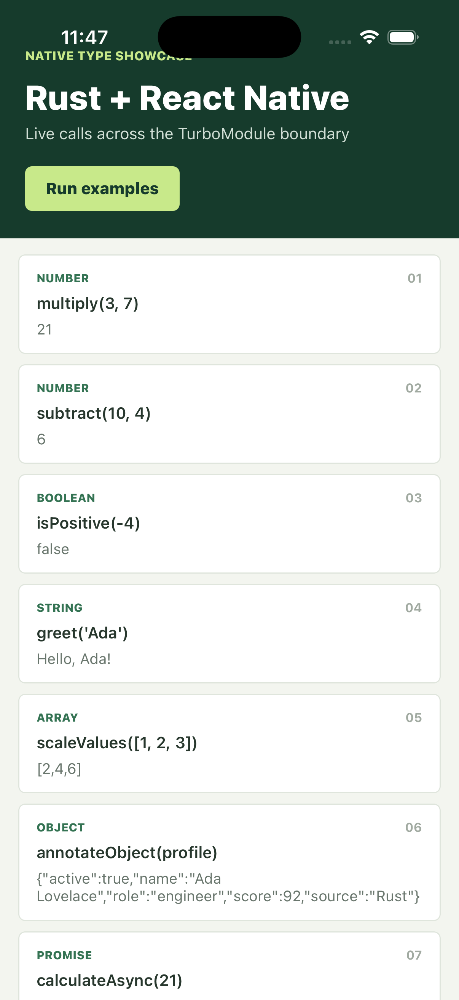

# react-native-awesome-library

A React Native C++ TurboModule library backed by Rust. The TypeScript TurboModule `Spec` is the API contract; Rust implements the logic. [`@rejaul/react-native-rust`](https://www.npmjs.com/package/@rejaul/react-native-rust) generates the C ABI, C++ bridge, and TypeScript wrappers connecting the two. The `example/` app calls every method on both Android and iOS through the generated bridge.

## Screenshots

The `example/` app calling every generated method and rendering its live Rust result, on both platforms:

| Android | iOS |
| --- | --- |
|  |  |

## Requirements

- Node.js 22.11 or newer and Yarn 4
- Rust (`rustup` and `cargo`)
- Android Studio with Android SDK, NDK, CMake, and an Android emulator, plus `cargo-ndk` for Android builds
- macOS with Xcode command-line tools and the Rust Apple targets for iOS builds

## Install

Run from the library root:

```sh
yarn install
```

Install Rust and the Android targets if needed:

```sh
curl --proto '=https' --tlsv1.2 -sSf https://sh.rustup.rs | sh
source "$HOME/.cargo/env"
rustup target add aarch64-linux-android armv7-linux-androideabi i686-linux-android x86_64-linux-android
cargo install cargo-ndk
```

The `rust:generate`, `rust:build:ios`, and `rust:build:android` scripts in [`package.json`](package.json) run the `react-native-rust` CLI. They resolve it from `@rejaul/react-native-rust` as a devDependency:

```sh
npm install --save-dev @rejaul/react-native-rust
```

## Where To Write Code

The TypeScript interface is the source of truth. This library's [`src/NativeAwesomeLibrary.ts`](src/NativeAwesomeLibrary.ts) already declares one method per supported type, each backed by a Rust handler under `rust/src/api/`:

```ts
export interface Spec extends TurboModule {
  multiply(a: number, b: number): number;
  subtract(a: number, b: number): number;
  isPositive(value: number): boolean;
  greet(name: string): string;
  scaleValues(values: number[]): number[];
  annotateObject(value: CodegenTypes.UnsafeObject): CodegenTypes.UnsafeObject;
  calculateAsync(value: number): Promise<number>;
  inspectWithCallback(
    value: CodegenTypes.UnsafeObject,
    callback: (label: string, score: number, active: boolean, details: CodegenTypes.UnsafeObject) => void
  ): void;
}
```

- `rust/src/api/multiply.rs`, `subtract.rs`, `is_positive.rs`, `greet.rs`, `scale_values.rs` implement the scalar, string, and array methods.
- `rust/src/api/annotate_object.rs` implements the `CodegenTypes.UnsafeObject` round trip.
- `rust/src/api/calculate_async.rs` implements the `Promise<number>` method.
- `rust/src/api/inspect_with_callback.rs` implements the synchronous-callback method.

For example:

```rust
pub fn multiply(a: f64, b: f64) -> f64 {
    a * b
}
```

The generator creates the C ABI functions, C++ TurboModule methods, and TypeScript wrappers. Avoid editing generated C++ or wrapper code directly.

## Add A Function

1. Add a supported method to `Spec` in `src/NativeAwesomeLibrary.ts`. Supported types are `number`, `boolean`, `string`, JSON-safe arrays, `CodegenTypes.UnsafeObject`, `void`, `Promise<T>` over those payload types, and a synchronous callback parameter (up to four explicitly typed parameters, not usable on `Promise` methods). Typed object structs, optional/rest/destructured parameters, generics, and overloads are rejected before any files are generated.
2. Regenerate the Rust stub and native/TypeScript glue:

	```sh
	yarn rust:generate
	```

3. Implement its generated function in `rust/src/api/<method-name>.rs`. Regeneration preserves existing Rust function bodies. Unsupported types fail with an error before generated files are changed.
4. Rebuild TurboModule Codegen and TypeScript output:

	```sh
	yarn prepare
	```

## Run On Android

Make sure Rust, `cargo-ndk`, and an Android emulator are installed and available. From the library root, build the Rust archives and generate the TurboModule sources:

```sh
source "$HOME/.cargo/env"
yarn rust:build:android
yarn prepare
```

The Rust build creates archives for `arm64-v8a`, `armeabi-v7a`, and `x86_64`. The example's `yarn android` command builds only the ABI of the connected emulator, avoiding a request for an archive that was not generated.

Open two terminals in the `example/` directory. In the first, start Metro:

```sh
yarn start
```

In the second, build and launch on the connected emulator:

```sh
yarn android
```

The example app is in `example/src/App.tsx`. It calls all eight generated methods and renders each result, including the `calculateAsync` Promise and the `inspectWithCallback` synchronous callback:

```tsx
import { multiply, subtract, isPositive, greet, scaleValues, annotateObject, calculateAsync, inspectWithCallback } from 'react-native-awesome-library';

const product = multiply(3, 7);        // 21
const difference = subtract(10, 4);    // 6
const positive = isPositive(-4);       // false
const greeting = greet('Ada');         // "Hello, Ada!"
const scaled = scaleValues([1, 2, 3]); // [2, 4, 6]
```

To use two terminals instead, start Metro from the library root with `yarn workspace react-native-awesome-library-example start --reset-cache`, then run the Android command above in a second terminal.

## Run On iOS

From the library root, build the Rust device and simulator archives and generate the native module code:

```sh
source "$HOME/.cargo/env"
yarn rust:build:ios
yarn prepare
```

Install CocoaPods once, or again after native dependencies change:

```sh
cd example/ios
pod install
cd ..
```

Start Metro from `example/` in one terminal:

```sh
yarn start --reset-cache
```

In a second terminal, build and launch the iOS simulator app:

```sh
yarn ios --simulator "iPhone 17 Pro"
```

## Test

```sh
source "$HOME/.cargo/env"
yarn rust:test
```

The generated Rust crate currently has no unit tests by default; this command verifies that the handlers compile. Add Rust unit tests alongside your implementations as the library grows.

## License

MIT
